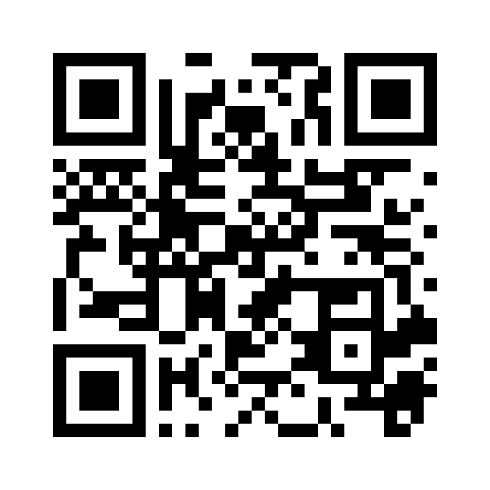

# qrcode.react

A React component to generate [QR codes](http://en.wikipedia.org/wiki/QR_code) for rendering to the DOM.



## Installation

```sh
npm install qrcode.react
```

## Usage

`qrcode.react` exports two components, supporting rendering as SVG or Canvas. SVG is generally recommended as it is more flexible, but Canvas may be preferable.

All examples are shown using modern JavaScript modules and syntax. CommonJS `require('qrcode.react')` is also supported.

### `QRCodeSVG`

```js
import ReactDOM from 'react-dom';
import {QRCodeSVG} from 'qrcode.react';

ReactDOM.render(
  <QRCodeSVG value="https://reactjs.org/" />,
  document.getElementById('mountNode')
);
```

### `QRCodeCanvas`

```js
import ReactDOM from 'react-dom';
import {QRCodeCanvas} from 'qrcode.react';

ReactDOM.render(
  <QRCodeCanvas value="https://reactjs.org/" />,
  document.getElementById('mountNode')
);
```

## Available Props

Below is a condensed type definition of the props `QRCodeSVG` and `QRCodeCanvas` accept.

```ts
type QRProps = {
  /**
   * The value to encode into the QR Code.
   */
  value: string;
  /**
   * The size, in pixels, to render the QR Code.
   * @defaultValue 128
   */
  size?: number;
  /**
   * The Error Correction Level to use.
   * @see https://www.qrcode.com/en/about/error_correction.html
   * @defaultValue L
   */
  level?: 'L' | 'M' | 'Q' | 'H';
  /**
   * The background color used to render the QR Code.
   * @see https://developer.mozilla.org/en-US/docs/Web/CSS/color_value
   * @defaultValue #FFFFFF
   */
  bgColor?: string;
  /**
   * The foregtound color used to render the QR Code.
   * @see https://developer.mozilla.org/en-US/docs/Web/CSS/color_value
   * @defaultValue #000000
   */
  fgColor?: string;
  /**
   * Whether or not a margin of 4 modules should be rendered as a part of the
   * QR Code.
   * @deprecated Use `marginSize` instead.
   * @defaultValue false
   */
  includeMargin?: boolean;
  /**
   * The number of _modules_ to use for margin. The QR Code specification
   * requires `4`, however you can specify any number. Values will be turned to
   * integers with `Math.floor`. Overrides `includeMargin` when both are specified.
   * @defaultValue 0
   */
  marginSize?: number;
  /**
   * The title to assign to the QR Code. Used for accessibility reasons.
   */
  title?: string;
  /**
   * The minimum version used when encoding the QR Code. Valid values are 1-40
   * with higher values resulting in more complex QR Codes. The optimal
   * (lowest) version is determined for the `value` provided, using `minVersion`
   * as the lower bound.
   * @defaultValue 1
   */
  minVersion?: number;
  /**
   * The settings for the embedded image.
   */
  imageSettings?: {
    /**
     * The URI of the embedded image.
     */
    src: string;
    /**
     * The height, in pixels, of the image.
     */
    height: number;
    /**
     * The width, in pixels, of the image.
     */
    width: number;
    /**
     * Whether or not to "excavate" the modules around the embedded image. This
     * means that any modules the embedded image overlaps will use the background
     * color.
     */
    excavate: boolean;
    /**
     * The horiztonal offset of the embedded image, starting from the top left corner.
     * Will center if not specified.
     */
    x?: number;
    /**
     * The vertical offset of the embedded image, starting from the top left corner.
     * Will center if not specified.
     */
    y?: number;
    /**
     * The opacity of the embedded image in the range of 0-1.
     * @defaultValue 1
     */
    opacity?: number;
    /**
     * The cross-origin value to use when loading the image. This is used to
     * ensure compatibility with CORS, particularly when extracting image data
     * from QRCodeCanvas.
     * Note: `undefined` is treated differently than the seemingly equivalent
     * empty string. This is intended to align with HTML behavior where omitting
     * the attribute behaves differently than the empty string.
     */
    crossOrigin?: 'anonymous' | 'use-credentials' | '' | undefined;
  };
};
```

### `value`

The value to encode into the QR Code. See [Encoding Mode](#encoding-mode) for additional details.

| Type     | Default Value |
| -------- | ------------- |
| `string` | —             |

### `size`

The size, in pixels, to render the QR Code.

| Type     | Default Value |
| -------- | ------------- |
| `number` | `128`         |

### `level`

The Error Correction Level to use. Information is encoded in QR Codes such that they can lose part of their visible areas and still be decodable. The amount of correction depends on this value. Higher error correction will result in more complex QR Codes.

- `L` = low (~7%)
- `M` = medium (~15%)
- `Q` = quartile (~25%)
- `H` = high (~30%)

See [Wikipedia](https://en.wikipedia.org/wiki/QR_code#Error_correction) or the [official QR Code documentation](https://www.qrcode.com/en/about/error_correction.html) for a more detailed explaination.

| Type               | Default Value |
| ------------------ | ------------- |
| `L \| M \| Q \| H` | `L`           |

### `bgColor`

The background color used to render the QR Code. This is passed directly to the Canvas (`ctx.fillStyle = bgColor`) or the SVG `<path>` (`fill={bgColor}`), both which accept any [CSS color](https://developer.mozilla.org/en-US/docs/Web/CSS/color_value).

| Type     | Default Value |
| -------- | ------------- |
| `string` | `#FFFFFF`     |

### `fgColor`

The foreground color used to render the QR Code. It follows the same constraints as `bgColor`

| Type     | Default Value |
| -------- | ------------- |
| `string` | `#000000`     |

### `includeMargin`

> [!WARNING]
> This has been deprecated in v4 and will be removed in a future version. Use `marginSize` instead.

Whether or not a margin of 4 modules should be rendered as a part of the QR Code.

| Type      | Default Value |
| --------- | ------------- |
| `boolean` | `false`       |

### `marginSize`

The number of _modules_ to use for margin. The QR Code specification requires `4`, however you can specify any number. Values will be turned to integers with `Math.floor`. Overrides `includeMargin` when both are specified.

| Type     | Default Value |
| -------- | ------------- |
| `number` | `0`           |

### `title`

The title to assign to the QR Code. Used for accessibility reasons.

| Type     | Default Value |
| -------- | ------------- |
| `string` | —             |

### `minVersion`

The minimum version used when encoding the QR Code. Valid values are 1-40 with higher values resulting in more complex QR Codes. The optimal (lowest) version is determined for the `value` provided, using `minVersion` as the lower bound.

| Type     | Default Value |
| -------- | ------------- |
| `number` | `1`           |

### `imageSettings`

Used to specify the details for an embedded image, often used to embed a logo.

| Type                        | Default Value |
| --------------------------- | ------------- |
| `object` (see fields below) | —             |

### `imageSettings.src`

The URI of the embedded image. This will get passed directly to `src` of an `img` element for `QRCodeCanvas` or the `href` of an inline `image` for `QRCodeSVG`.

| Type     | Default Value |
| -------- | ------------- |
| `string` | —             |

### `imageSettings.height`

The height, in pixels, of the embedded image.

| Type     | Default Value |
| -------- | ------------- |
| `number` | —             |

### `imageSettings.width`

The width, in pixels, of the embedded image.

| Type     | Default Value |
| -------- | ------------- |
| `number` | —             |

### `imageSettings.excavate`

Whether or not to "excavate" the modules around the embedded image. This means that any modules the embedded image overlaps will use the background color. Use this to ensure clean edges around your image. It is also useful when embedding images with transparency.

| Type      | Default Value |
| --------- | ------------- |
| `boolean` | —             |

### `imageSettings.x`

The horizontal offset, in pixels, of the embedded image. Positioning follows standard DOM positioning, with top left corner being 0.

When not specified, will center the image.

| Type     | Default Value |
| -------- | ------------- |
| `number` | —             |

### `imageSettings.y`

The vertical offset, in pixels, of the embedded image. Positioning follows standard DOM positioning, with top left corner being 0.

When not specified, will center the image.

| Type     | Default Value |
| -------- | ------------- |
| `number` | —             |

### `imageSettings.opacity`

The opacity of the embedded image, in the range of 0 to 1.

| Type     | Default Value |
| -------- | ------------- |
| `number` | 1             |

### `imageSettings.crossOrigin`

The `cross-origin` value to use when loading the embedded image. Note that `undefined` works as typically does with React, excluding the attribute from the DOM node. This is intended to align with HTML behavior where omitting the attribute behaves differently than the empty string.

| Type     | Default Value |
| -------- | ------------- |
| `string` | —             |

## Custom Styles

`qrcode.react` will pass through any additional props to the underlying DOM node (`<svg>` or `<canvas>`). This allows the use of inline `style` or custom `className` to customize the rendering. One common use would be to support a responsive layout.

> [!NOTE]
> In order to render QR Codes in `<canvas>` on high density displays, we scale the canvas element to contain an appropriate number of pixels and then use inline styles to scale back down. We will merge any additional styles, with custom `height` and `width` overriding our own values. This allows scaling to percentages _but_ if scaling beyond the `size`, you will encounter blurry images. I recommend detecting resizes with something like [react-measure](https://github.com/souporserious/react-measure) to detect and pass the appropriate size when rendering to `<canvas>`.

## Encoding Mode

`qrcode.react` supports encoding text only, in a single segment. The encoding library being used does minimal detection to determine if the text being encoded can follow an optimized path for Numeric or Alphanumeric modes, allowing for more data to be encoded. Otherwise, it will encode following Byte mode. This mode includes supports multi-byte Unicode characters such as Kanji, however it does not support the optimized Kanji encoding mode.

## LICENSE

`qrcode.react` is licensed under the [ISC license](LICENSE).

`qrcode.react` bundles [QR Code Generator](https://www.nayuki.io/page/qr-code-generator-library), which is available under the [MIT license](src/third-party/qrcodegen/LICENSE).
